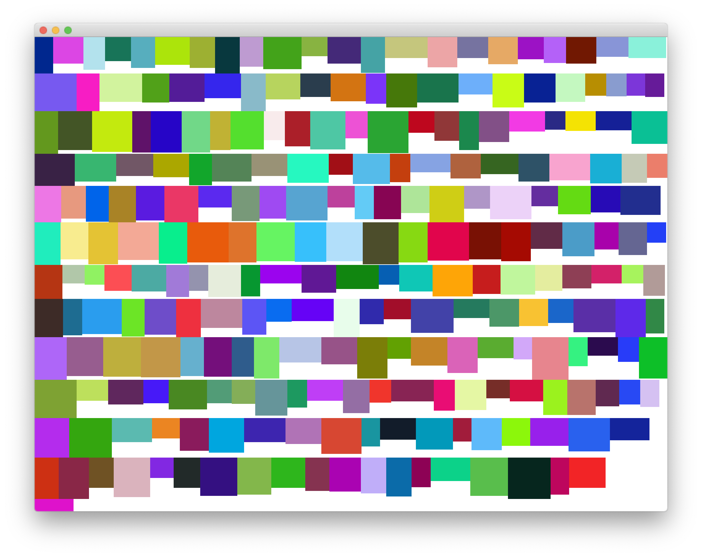

ofxShelfWrap
================

A small OpenFrameworks wrapper/adaption of [shelf-pack.cpp](https://github.com/mapbox/shelf-pack-cpp).

Allows passing OpenFrameworks ofRectangle objects to a packer instance for 2D bin packing.

See examples and ofxShelfPack.h for documentation 